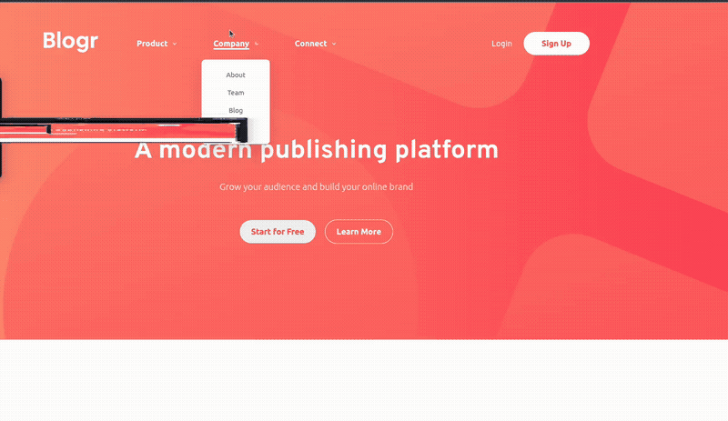
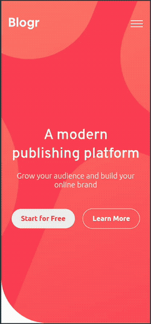

# 🚀 Frontend Mentor Challenge - Blogr Landing Page 

Este es mi proceso para el reto de **Blogr Landing Page** de Frontend Mentor. El objetivo principal fue lograr una interfaz moderna, limpia y, sobre todo, **funcional** 

## 📸 Preview

Demo: [ver sitio](https://francocam1.github.io/challenge-landing-page-blogr/)

### 🖥️ Desktop

  

### 📱 Mobile

  

## 🛠️ Construido con

*   **HTML5** - Marcado semántico para mejor SEO.
*   **CSS3** - Variables personalizadas (Custom Properties) y Flexbox.
*   **JavaScript (Vanilla)** - Lógica pura, sin librerías . 🍦
*   **BEM Methodology** - Para un código CSS ordenado y escalable.

---

Hecho con mucha pasion por **[francocam1](https://www.github.com/francocam1)** 😎
